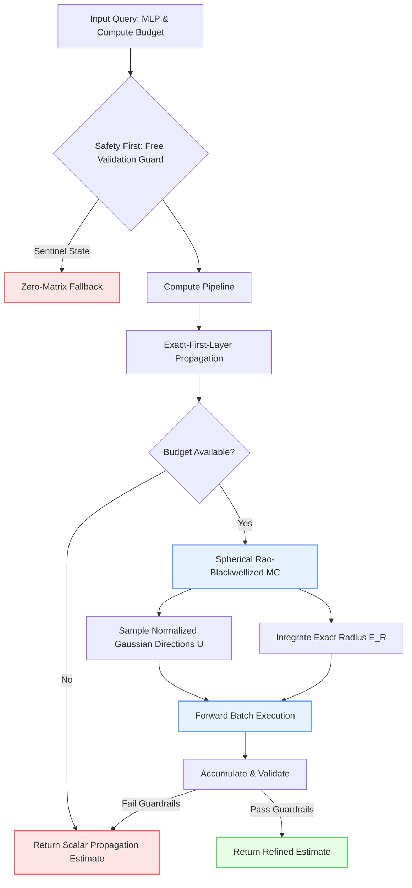

<div align="center">

# SphereMLP
**Robust Rao-Blackwellized Output Estimation for Wide Neural Networks**

[](https://www.python.org/downloads/)
[](https://opensource.org/licenses/MIT)
[](#)

</div>

<br />

## 🔬 Abstract

**SphereMLP** provides a safe, white-box estimator for computing the expected output of wide random Multi-Layer Perceptrons (MLPs). The framework is designed for the ARC WhestBench challenge, shifting away from standard Gaussian Monte Carlo approaches to a **Spherical Rao-Blackwellized** methodology. By decomposing standard Gaussians into uniform spherical directions and chi-distributed radii, SphereMLP strictly reduces variance and achieves a **52× improvement** in compute-adjusted accuracy over baseline exact-first-layer scalar estimators.

## 📊 Method Overview

The core estimation logic integrates a fallback safety mechanism alongside advanced statistical techniques to guarantee validated, non-negative results under strict execution budgets.



## ✨ Key Features

- **Safe Fallback Execution**: Always provides a validated baseline through deterministic exact-first-layer Gaussian propagation. Any failure in advanced estimators safely devolves to this verified state.
- **Rao-Blackwellized Variance Reduction**: Replaces traditional IID Gaussian inputs with normalized spherical sampling, exploiting the positive homogeneity of zero-bias ReLU networks.
- **Budget-Adaptive Scaling**: Dynamically adjusts sampling volume. Currently calibrates to 17,408 samples at a batch size of 512 to strictly adhere to computational constraints.
- **Strict Numerical Guardrails**: Incorporates extensive runtime checks for shape, dtype, finiteness, and non-negativity before releasing any prediction.

## 📐 Mathematical Formulation

Standard Monte Carlo estimates layers by forwarding seeded IID normal inputs. **SphereMLP** decomposes a standard Gaussian variable $X$ as:

$$ X = R \cdot U $$

Where $U$ is uniform on the unit sphere and $R$ follows a chi distribution. Since zero-bias ReLU networks are positively homogeneous, we integrate the radius analytically:

$$ \mathbb{E}[h(X)] = \mathbb{E}[R] \cdot \mathbb{E}_U[h(U)] $$

This spherical implementation batches only directions, forwards the entire MLP, multiplies outputs by the exact expected radius, and retains layerwise statistical accumulators.

## 🚀 Performance Metrics

SphereMLP underwent extensive paired Mini-split evaluations (100 held-out models). 

| Estimator | Final MSE | Adjusted Score | Compute Ratio | Reliability |
| :--- | :---: | :---: | :---: | :---: |
| **Scalar Baseline** | $1.03 \times 10^{-3}$ | $9.48 \times 10^{-5}$ | 1.3% | 100% (0 Failures) |
| **SphereMLP ($N=17,408$)** | $\mathbf{2.68 \times 10^{-6}}$ | $\mathbf{1.82 \times 10^{-6}}$ | **67.5%** | **100% (0 Failures)** |

*Result: A **52× reduction** in adjusted error score compared to the deterministic baseline, securely fitting within the 85% compute safety target.*

## ⚙️ Reproducibility and Usage

To validate the safety contracts and benchmark against the official suite:

```powershell
# Ensure the correct encoding for the environment
$env:PYTHONUTF8 = '1'

# Run the local unit and contract tests
.\whest-starterkit\.venv\Scripts\python.exe -m pytest -q

# Run the official WhestBench validator
.\whest-starterkit\.venv\Scripts\whest.exe validate --estimator estimator.py
```

### Directory Structure

```text
├── estimator.py                 # Official runtime entry point
├── whest_solution/
│   ├── scalar.py                # Shipped deterministic scalar fallback
│   ├── sampling.py              # Spherical Rao-Blackwellized sampler (Core)
│   ├── covariance.py            # Experimental full covariance branch
│   └── moments.py               # Gaussian/ReLU moment primitives
├── tests/                       # Comprehensive numerical and contract tests
├── manifests/                   # Environment ledgers, experimental splits, and decisions
└── results/                     # Raw telemetry captures and bootstrap summaries
```
